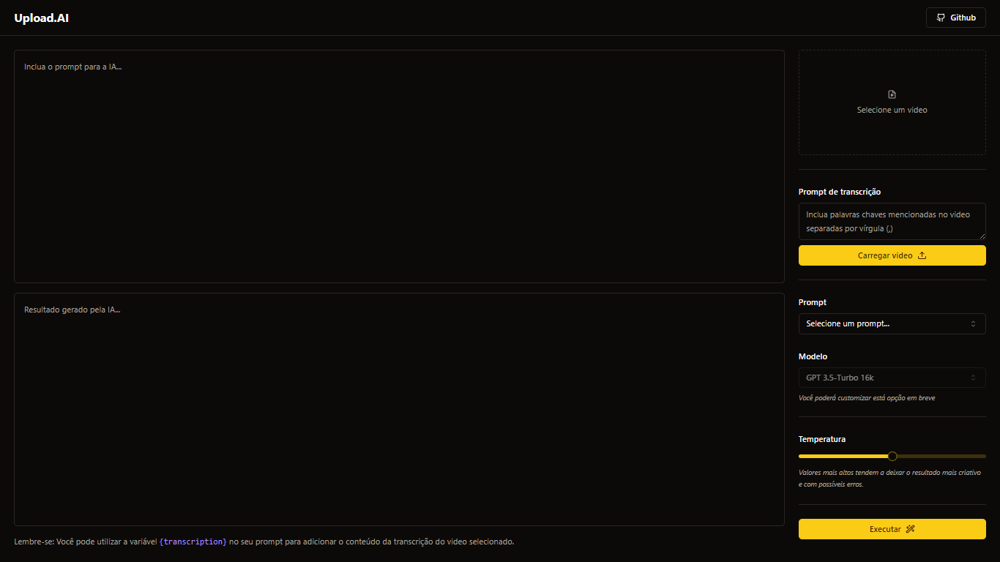

<h1 align="center">
    
</h1>
<p align="center">
    
    
    
    <a href="https://github.com/NyctibiusVII/Upload.AI/blob/main/LICENSE">
        
    </a>
</p>
<p align="center">
    <a href="#Upload.AI-">Projeto</a>&nbsp;&nbsp;&nbsp;|&nbsp;&nbsp;&nbsp;
    <a href="#tecnologias-">Tecnologias</a>&nbsp;&nbsp;&nbsp;|&nbsp;&nbsp;&nbsp;
    <a href="#layout-">Layout</a>&nbsp;&nbsp;&nbsp;|&nbsp;&nbsp;&nbsp;
    <a href="#licença-%EF%B8%8F">Licença</a>
</p>

# Upload.AI 
Geração de títulos e descrições automatizadas e personalizáveis via inteligencia artificial (IA) por video (mp4) upado. Para Youtube | Twitch | Outras plataformas... 🤖📑

#### Funcionalidades
* GPT-AI
    * __Modelo__: _GPT-3.5-Turbo 16k_
    * __Temperatura__: _variável(0.0 - 1.0)_
* Upload de vídeo (mp4)
* Prompt
    * __Tipo__: _Titulo, descrição_
* Prompt de transcrição
    * __Palavras chave__:
        <p>EX: ReactJS, Vite, AI, Radix, Youtube</p>

## Tecnologias 🚀
Esse projeto foi desenvolvido com as seguintes tecnologias:
- [ReactJS](https://pt-br.reactjs.org)
- [Typescript](https://www.typescriptlang.org)
- [Vite](https://vitejs.dev)
- [Radix UI](https://www.radix-ui.com)
- [TailwindCSS](https://tailwindcss.com)

## Layout 🚧
### Desktop Screenshot
<div style="display: flex; flex-direction: 'column'; align-items: 'center';">
<!-- Responsive, 1366 x 768, 50% (Laptop L - 1366px) -->
    
    <!--  -->
</div>

<!-- ### Mobile Screenshot -->
<!-- <div style="display: flex; flex-direction: 'row';"> -->
<!-- Responsive, 320 x 711, 75% (Mobile X11T - 320px) -->
<!--  -->
<!--  -->
<!-- </div> -->

## Rodando o projeto 🚴🏻‍♂️
#### "Só vou dar uma olhadinha...":
  <a href="https://upload-ai.vercel.app">🤖 Site hospedado na Vercel 📑</a>

#### Na sua maquina:
```bash
# Clone o repositório
$ git clone https://github.com/NyctibiusVII/Upload.AI.git

# Acesse a pasta do projeto no terminal
$ cd Upload.AI

# Instale as dependências com o gerenciador de pacotes de sua preferência
$ npm install   /   yarn add   /   pnpm install

# Execute o projeto
$ npm run dev   /   yarn dev   /   pnpm run dev

# O projeto roda na porta: 5173

# Acesse http://localhost:$PORT *Ex: Cuidado para não ligar dois ou mais projetos na mesma porta.
```

## Contribuição 💭
Confira a página de [contribuição](./CONTRIBUTING) para ver como começar uma discussão e começar a contribuir.

## Licença ⚖️
Este projeto está sob a licença do MIT. Veja o arquivo [LICENSE](https://github.com/NyctibiusVII/Upload.AI/blob/main/LICENSE) para mais detalhes.

## Contribuidores 🦸🏻‍♂️
<a href="https://github.com/NyctibiusVII/Upload.AI/graphs/contributors">
    
</a>

<br/>
<br/>

###### Feito com ❤️ por Matheus Vidigal 👋🏻 [Entre em contato!](https://www.linkedin.com/in/matheus-vidigal-nyctibiusvii)